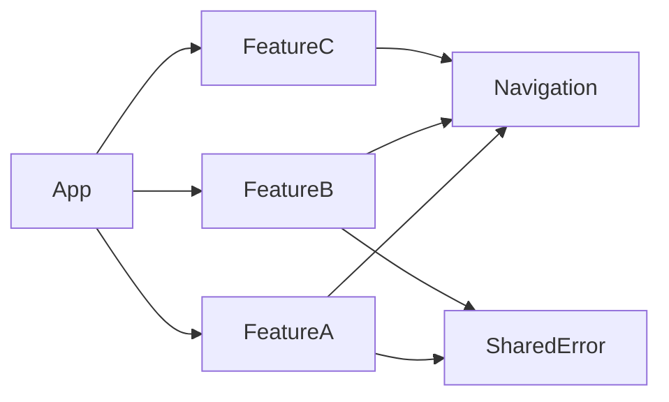
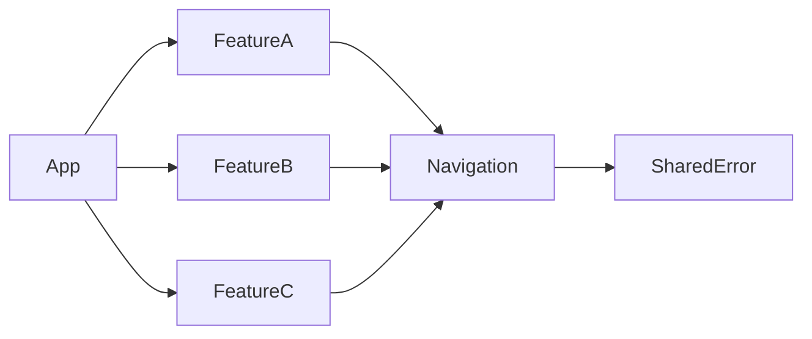

This is a second article in a short series about architecture concepts for apps with multiple small independent modules. You can find the previous article here: [Decoupled stacked sheet navigation with multiple modals in SwiftUI]().

- consistent handling of errors
- Define our own errors with localized user-facing messages:

```swift
enum APIError: LocalizedError {
    case networkUnavailable

    public var errorDescription: String? {
        switch self {
        case .networkUnavailable:
            return "Network Unavailable"
        }
    }

    public var failureReason: String? {
        switch self {
        case .networkUnavailable:
            return "It seems that your device is not connected to the internet."
        }
    }

    public var recoverySuggestion: String? {
        switch self {
        case .networkUnavailable:
            return "Please confirm your network connection and try again."
        }
    }
}
```
{: file="SomeModule/APIError.swift" }


Again, as in the previous article we have a `Router` that handles navigations and transitions


```swift
import Navigation

struct SomeView: View, Routable {
    @Environment(Router.self) private var router

    var body: some View {
        Text("Hello, world!")
        .task {
            do {
                try await load()
            } catch {
                handle(error)
            }
        }
    }

    private func load() async throws {
      // ...
      throw APIError.networkUnavailable
    }
}
```
{: file="SomeModule/SomeView.swift" }

- In a protocol that belongs to our root app we 

[TODO: rewrite to switch]
```swift
public protocol Routable: Observable {
    var router: Router { get }
    func handle(_ error: Error)
}

@MainActor
public extension Routable {
    func handle(_ error: Error) {
        if let error = error as? APIError {
            // Handling specific errors
            router.showAlert(for: error)
        } else if let error = error as? LocalizedError {
            // Handling all other localized errors
            #if DEV
                router.showAlert(for: error)
            #endif
        } else {
            // handle the rest (e.g. with logging only)
        }
    }
}
```
{: file="Navigation/Routable.swift" }

```swift
import Router

public struct MyApp: App {
    @Bindable private var router = Router()

    public var body: some Scene {
        WindowGroup {
            MainView()
                .alert(
                    router.presentedError?.errorDescription ?? "Error",
                    isPresented: $router.showingAlert,
                    presenting: router.presentedError,
                    actions: { _ in },
                    message: { error in
                        if error.failureReason != nil || error.recoverySuggestion != nil {
                            Text(error.failureReason ?? "")
                            + Text("\n")
                            + Text(error.recoverySuggestion ?? "")
                        } else {
                          // Gracefully handle unknown errors 
                        }
                    }
                )
        }
        .environment(router)
    }
}
```
{: file="MyApp.swift" }

```swift
import Observation

@MainActor
@Observable
public class Router {
    public init() {}
    public var presentedError: LocalizedError?

    public var showingAlert: Bool {
        get {
            presentedError != nil
        }
        set {
            if !newValue {
                presentedError = nil
            }
        }
    }

    public func showAlert(for error: LocalizedError) {
        presentedError = error
    }
}
```
{: file="Navigation/Router.swift" }

Now, this is all well and good for cases where our errors are only used in the modules they are defined in.  
But what if we have an error that is better reused across multiple modules.  
We can move our `APIError` type from a specific module to a separate shared module on which these feature modules depend.



And if we want to handle some errors differently than others?

We can do the following.  
Move the 

```swift
import SharedError

// ...

func handle(_ error: Error) {
    switch error {
    case let apiError as APIError:
        router.showAlert(for: apiError)

    case let localizedError as LocalizedError:
        #if DEV
            router.showAlert(for: localizedError)
        #else
            break
        #endif

    default:
        break
    }
    Logger.error(localizedError)
}
```
{: file="Navigation/Routable.swift" }

> Thanks for reading this far! 😆  
> The above pattern matching may seem a bit unusual, but fits our case quite well.
> If you're unfamiliar with it, I recommend visiting the [AppVenture Blog](https://appventure.me/guides/pattern_matching/intro.html) for a collection of advanced pattern matching expressions.
{: .prompt-info }

The dependency graph for this would look as follows:


