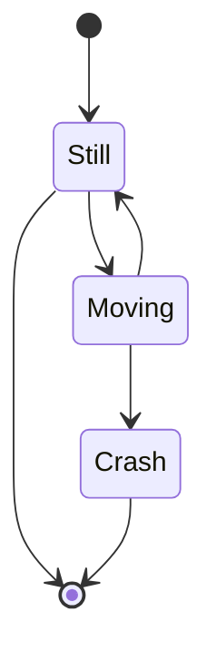
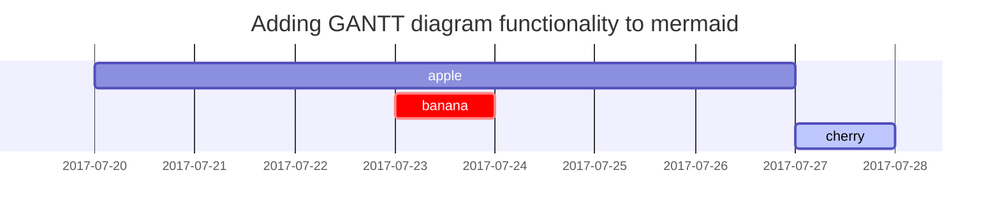

# First Post
 
Hi there,

this is more a repost than a post, but since I haven't done much with the previous version of this blog, I think it still counts. 😅

I've decided to start writing more about the things that I jot down while learning about new technologies and API and while developing my pet projects.  

For one, this hopefully helps me to improve my technical English writing skill.  

Also, writing a somewhat understandable blog post requires me to think more deeply about the matter at hand, and therefore will hopefully improve my understanding and retention of the material.

## Migrating to Jekyll

I decided to move to Jekyll as a framework for my tech blog for several reasons.

Wordpress is great and has lots of features but can feel a little heavy at times. I might have to invest a little more time into the setup, but Jekyll seems to give me way more control.

Another point is that I don't have too much experience with Ruby, and this gives me some opportunity to play around with it.

Now I'm able to quickly write up a post in markdown, and I can publish it by just moving it to the appropriate folder and push to the repository hosted on Netlify.

I will be migrating my first couple of posts from my Wordpress blog over here.

## So here are some visual tests

Just to check and see if I broke anything while tweaking the theme... 😅

- A 
- List 
  - with
  - some
  - items
- and more

| A    | Table       | with    |
| ---- | ----------- | ------- |
| some | interesting | content |
| and  | some        | more    |
| and  | then        | some    |

```
Some text in code
block
```

```terminal
cd some/dir
python some.py
```

```swift
// Some piece of code in Swift syntax highlighted
func hoge(a: String) -> Int? {
  return nil
}
```
{: file="Some/AwesomeFile.swift" }

and some `inline code` highlighting.

### Asset integration


_with caption_

### callout type boxes

> The body of the info box goes here.  You can write `Markdown` inside the block.
{: .prompt-info }

> The body of the tip goes here.  You can write `Markdown` inside the block.
{: .prompt-tip }

> The body of the warning box goes here.  You can write `Markdown` inside the block.
{: .prompt-warning }

> The body of the danger box goes here.  You can write `Markdown` inside the block.
{: .prompt-danger }

### SNS integration

#### Twitter Plugin

removed because it uses cookies

#### GitHub


#### Mermaid diagrams




