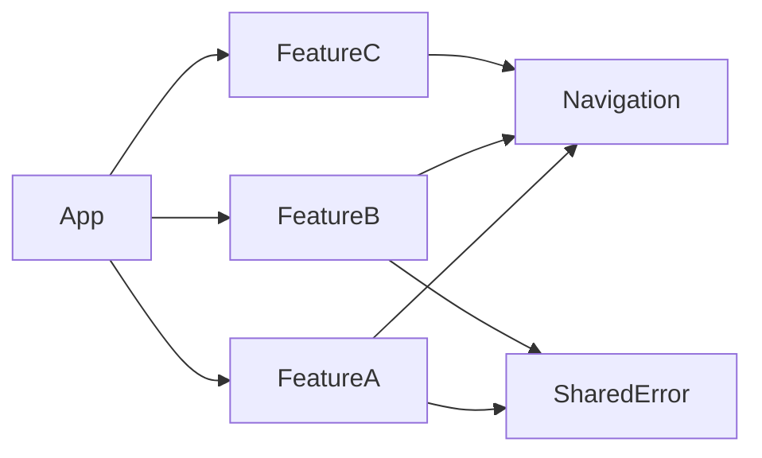
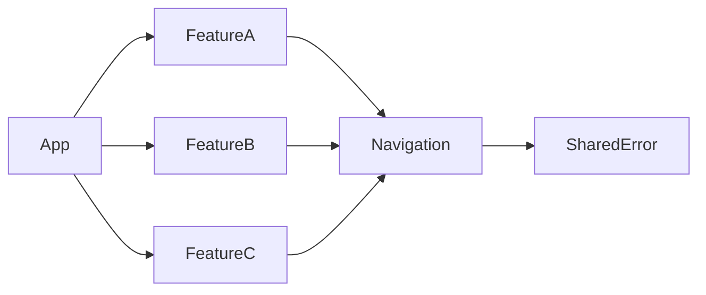

This is a second article in a short series about architecture concepts for apps with multiple small independent modules. You can find the previous article here: [Decoupled stacked sheet navigation with multiple modals in SwiftUI]().

In this article, we focus on the consistent handling of errors across independent modules. And thereby enhancing the user experience and simplifying the development process.

## Defining custom errors

To start, we define our own errors with localized user-facing messages. This is achieved by conforming our error to the `LocalizedError` protocol.

```swift
enum APIError: LocalizedError {
    case networkUnavailable

    public var errorDescription: String? {
        switch self {
        case .networkUnavailable:
            return "Network Unavailable"
        }
    }

    public var failureReason: String? {
        switch self {
        case .networkUnavailable:
            return "It seems that your device is not connected to the internet."
        }
    }

    public var recoverySuggestion: String? {
        switch self {
        case .networkUnavailable:
            return "Please confirm your network connection and try again."
        }
    }
}
```
{: file="SomeModule/APIError.swift" }

A typically feature module will have logic that throws an error at some point. For example when trying to load data while the network connection is not available.

```swift
struct SomeView: View, Routable {
    var body: some View {
        Text("Hello, world!")
        .task {
            do {
                try await load()
            } catch {
              // handle the error
            }
        }
    }

    private func load() async throws {
      // ...
      throw APIError.networkUnavailable
    }
}
```
{: file="SomeModule/SomeView.swift" }

Again, as in the previous article we have a `Router` that handles navigations and transitions. 

```swift
import Observation

@MainActor
@Observable
public class Router {
    public init() {}
    public var presentedError: LocalizedError?

    public var showingAlert: Bool {
        get {
            presentedError != nil
        }
        set {
            if !newValue {
                presentedError = nil
            }
        }
    }

    public func showAlert(for error: LocalizedError) {
        presentedError = error
    }
}
```
{: file="Navigation/Router.swift" }

At the root of our app, we inject the `Router` observable into the apps environment and wire up the alert presentation logic in a single point.
```swift
import Navigation

public struct MyApp: App {
    @Bindable private var router = Router()

    public var body: some Scene {
        WindowGroup {
            MainView()
                .alert(
                    router.presentedError?.errorDescription ?? "Error",
                    isPresented: $router.showingAlert,
                    presenting: router.presentedError,
                    actions: { _ in },
                    message: { error in
                        if error.failureReason != nil || error.recoverySuggestion != nil {
                            Text(error.failureReason ?? "")
                            + Text("\n")
                            + Text(error.recoverySuggestion ?? "")
                        } else {
                          // Gracefully handle unknown errors 
                        }
                    }
                )
        }
        .environment(router)
    }
}
```
{: file="MyApp.swift" }

This would require some redundant error handling code in our module view.  

```swift
import Navigation

struct SomeView: View, Routable {
    @Environment(Router.self) private var router

    var body: some View {
        Text("Hello, world!")
        .task {
            do {
                try await load()
            } catch {
                handle(error)
            }
        }
    }

    // ...

    func handle(_ error: Error) {
        if let error = error as? LocalizedError {
            router.showAlert(for: error)
        } else {
            // handle other errors (e.g. with logging only)
        }
    }
}
```
{: file="SomeModule/SomeView.swift" }

But if we extract that part into a view extension of our `Navigation` module, it can be shared with all feature modules:

```swift
public protocol Routable: Observable {
    var router: Router { get }
    func handle(_ error: Error)
}

@MainActor
public extension Routable {
    func handle(_ error: Error) {
        if let error = error as? LocalizedError {
            router.showAlert(for: error)
        } else {
            // handle other errors (e.g. with logging only)
        }
    }
}
```
{: file="Navigation/Routable.swift" }

```swift
import Navigation

struct SomeView: View, Routable {
    @Environment(Router.self) private var router

    var body: some View {
        Text("Hello, world!")
        .task {
            do {
                try await load()
            } catch {
                handle(error)
            }
        }
    }
}
```
{: file="SomeModule/SomeView.swift" }

## Sharing Errors Across Modules

Now, this is all well and good for cases where our errors are only used in the modules they are defined in.  
But what if we have an error that is better reused across multiple modules.  
We can move our `APIError` type from a specific module to a separate shared module on which these feature modules depend.



What if we want to handle some errors differently than others?
We can move the specific errors one step deeper into our dependency graph as a dependency of `Navigation`.
Which allows handle them as needed without the feature models needing to know about our navigation logic.

```swift
import SharedError

// ...

func handle(_ error: Error) {
    switch error {
    case let apiError as APIError:
        router.showAlert(for: apiError)

    case let localizedError as LocalizedError:
        // Bonus: with the pragma below, we show unspecified alerts only for debugging and testing
        #if DEV  
            router.showAlert(for: localizedError)
        #else
            break
        #endif

    default:
        break
    }
    Logger.error(localizedError)
}
```
{: file="Navigation/Routable.swift" }

> Thanks for reading this far! 😆  
> The above pattern matching may seem a bit unusual, but fits our case quite well.
> If you're unfamiliar with it, I recommend visiting the [AppVenture Blog](https://appventure.me/guides/pattern_matching/intro.html) for a collection of advanced pattern matching expressions.
{: .prompt-info }

The dependency graph for this would look as follows:



## Conclusion

By adopting a consistent and modular approach to error handling, we can significantly improve the user experience of our apps. This strategy not only simplifies development but also enhances the app's robustness and maintainability. As we continue to explore the architecture of apps with multiple small, independent modules, we'll discover more ways to leverage SwiftUI and Swift's powerful features to build sophisticated and user-friendly applications.

Stay tuned for more insights into SwiftUI and app architecture in our upcoming articles.
